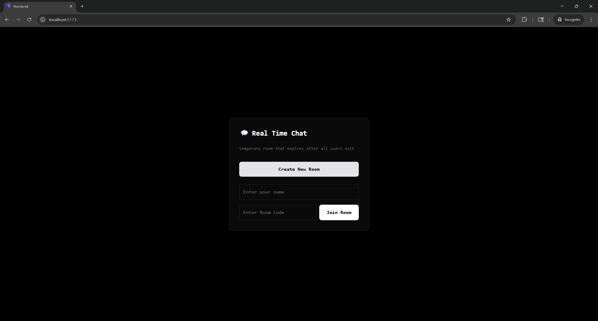
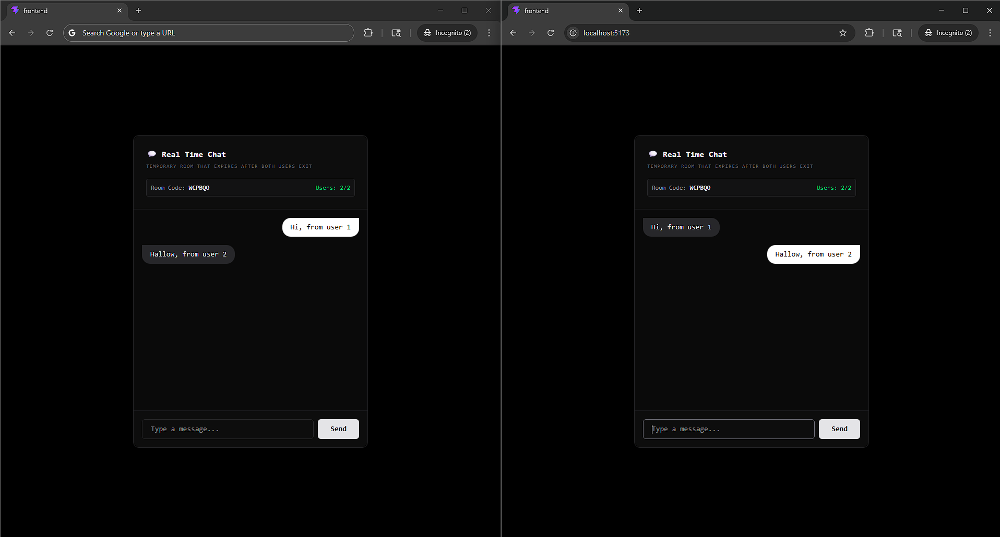

# 💬 Real-Time Chat Application

A simple, fast chat app where people can create temporary chat rooms and communicate in real-time using WebSockets.

  


---

## ✨ Features

- ✅ **Real-Time Messaging** - Messages appear instantly
- ✅ **Temporary Rooms** - Rooms expire when everyone leaves
- ✅ **Live User Count** - See who's in your room
- ✅ **Easy to Use** - Works on Windows, Mac, and Linux
- ✅ **Easy to Deploy** - Put it online in minutes

---

## 🛠️ Tech Stack

- **Frontend:** React + Vite + Tailwind CSS
- **Backend:** Node.js + WebSocket
- **Language:** TypeScript

---

## 📋 Requirements

- Node.js v18+ (for local development)
- npm (comes with Node.js)
- Git

---

## 🚀 Quick Start

### Step 1: Clone the Repository
```bash
git clone https://github.com/Subhradeep-Sikder/simple-chat-app.git
cd simple-chat-app
```

### Step 2: Start the Backend
Open a terminal:
```bash
cd backend
npm install
npm start
```

### Step 3: Start the Frontend
Open another terminal:
```bash
cd frontend
npm install
npm run dev
```

### Step 4: Open in Browser
Visit: `http://localhost:5173`

Open in two tabs with the same room code to test!

---

## 📝 Commands

| What | Command | Location |
|------|---------|----------|
| Start backend | `npm start` | `/backend` |
| Start frontend | `npm run dev` | `/frontend` |
| Build frontend | `npm run build` | `/frontend` |

---

## 🌐 Deploy Online

Want to put this online? See [DEPLOYMENT.md](./DEPLOYMENT.md)

---

